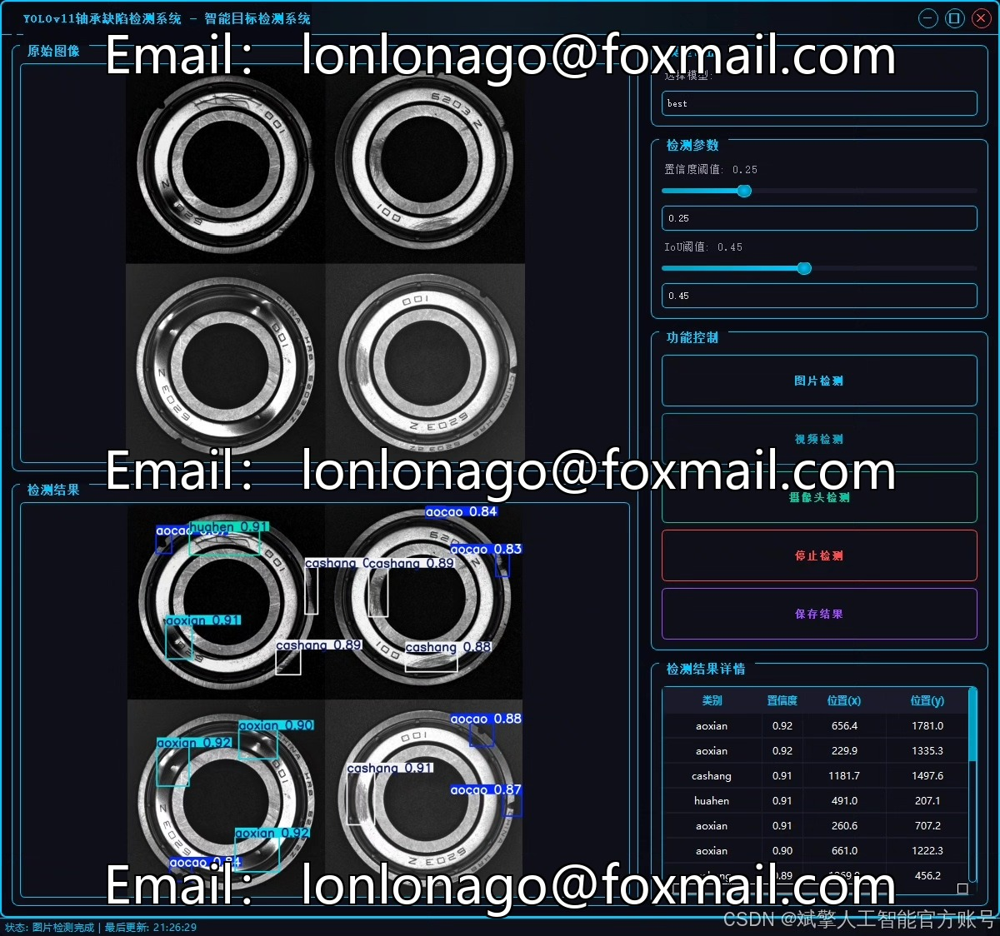
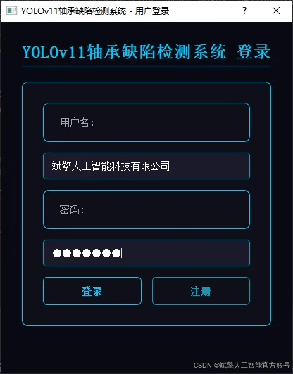
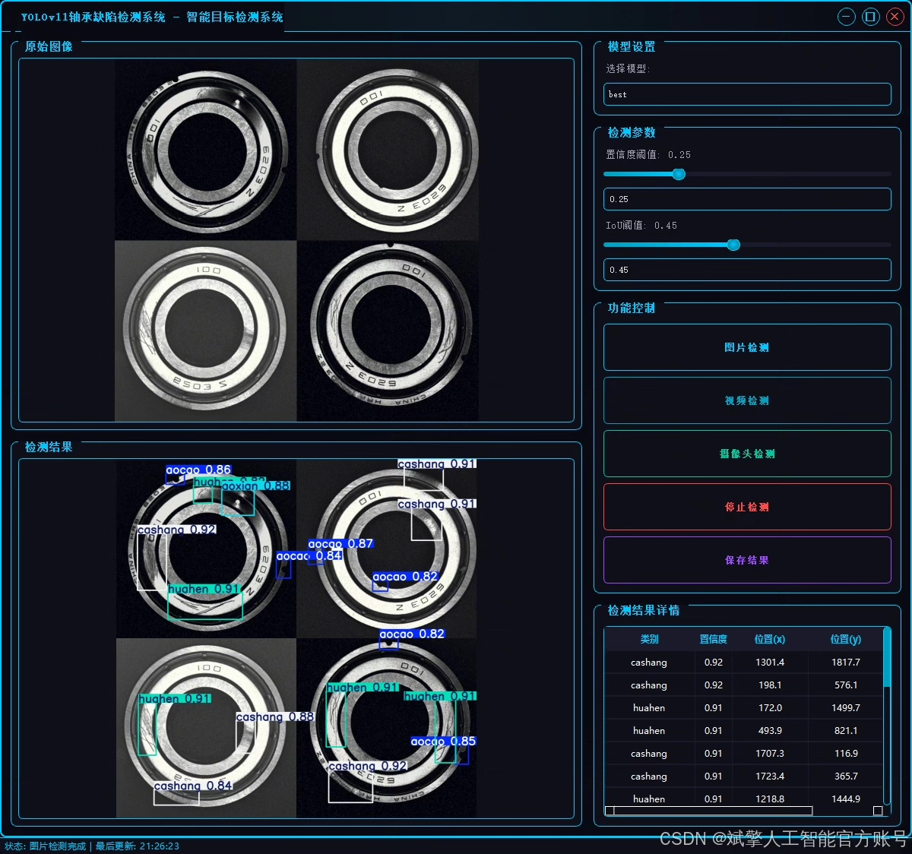
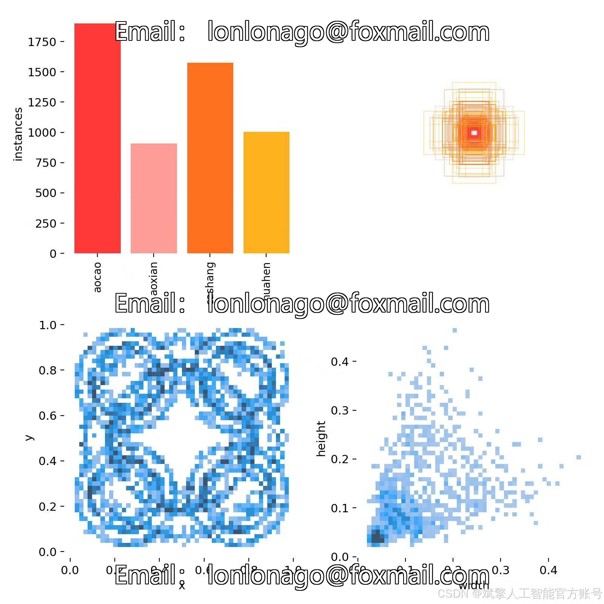
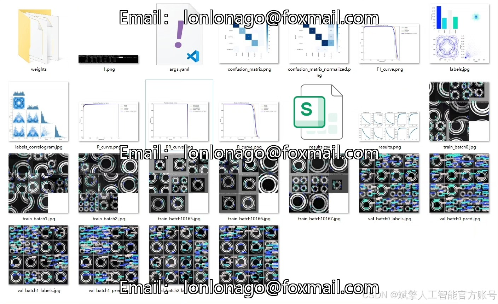
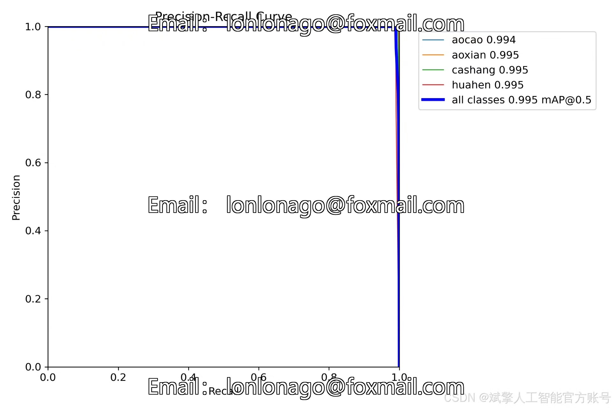
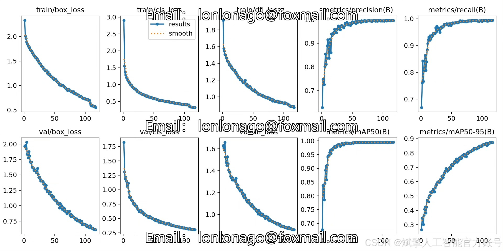
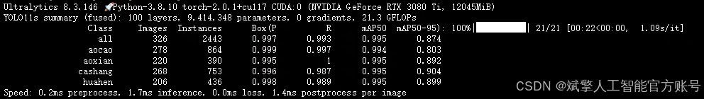
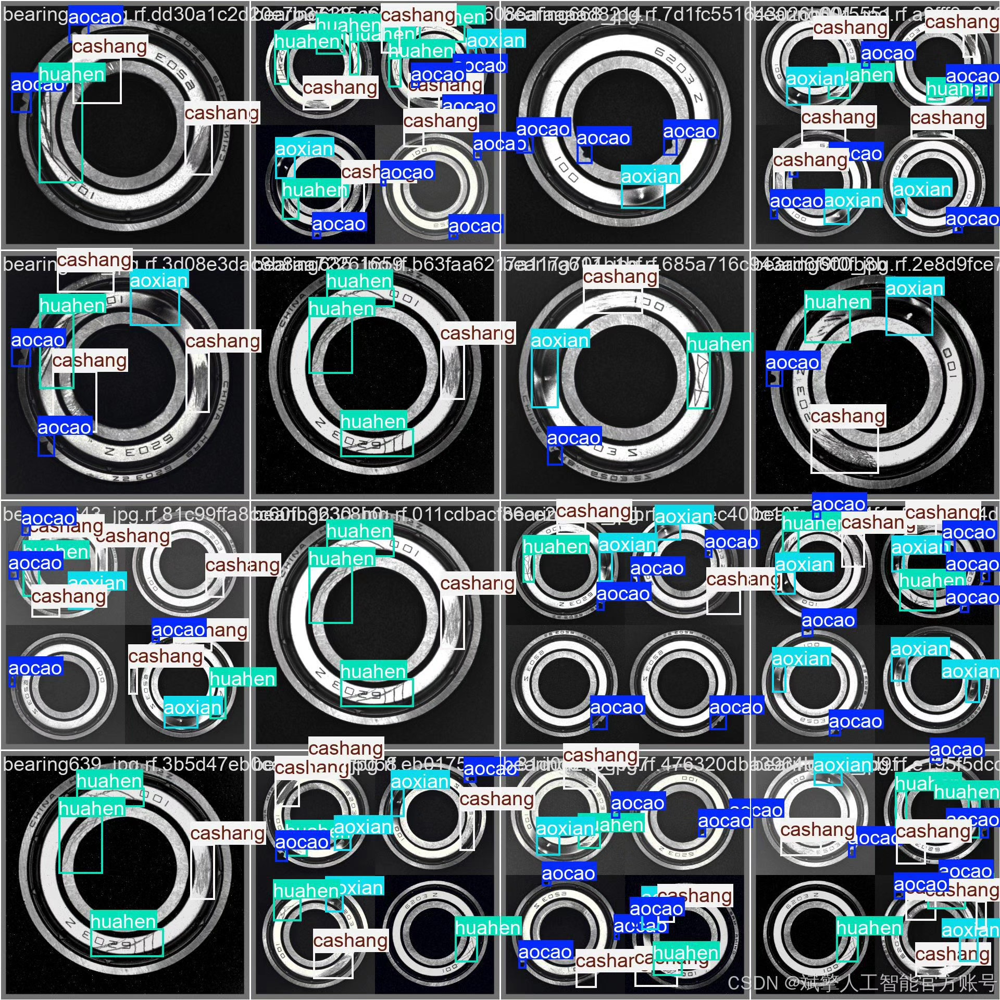

# YOLOv11 bearing defect detection system

## Body

YOLOv11 Bearing Defect Detection System Based on Deep Learning YOLOv11: A Smart Identification System for Bearing Defects

This paper designs and implements a smart identification system for bearing defects based on the deep learning target detection algorithm YOLOv11. It addresses four common defects on the surface of industrial bearings, including concave (aocao), indentation (aoxian), scratches (cashang), and scratches (huahen). A dataset containing 1,085 images (759 training and 326 validation) is constructed to optimize model performance through data augmentation and transfer learning. The system is developed using the PyTorch framework, featuring an intuitive UI interface with login and registration functions, supporting real-time detection and visualization of results. Experiments show that YOLOv11 achieves an average precision (mAP@0.5) of 99.5% on the validation set, significantly enhancing the efficiency of defect detection. This study provides a practical solution for industrial quality inspection automation.

Dataset:
nc: 4
names: ['aocao', 'aoxian', 'cashang', 'huahen'],
dataset quantity: 759 training images, 326 validation images

✅ User Login and Registration: Supports password verification and security validation.
✅ Three Detection Modes: Based on the YOLOv11 model, supports image, video, and real-time camera detection, accurately identifying targets.
✅ Dual-Screen Comparison: Displays the original image and detection results side by side.
✅ Data Visualization: Real-time table displays the category, confidence, and coordinates of detected targets.
✅ Intelligent Parameter Tuning: Offers a confidence slide bar to dynamically optimize detection accuracy, adapting to different scene requirements.
✅ Sci-Fi Interactive Interface: Dark theme paired with dynamic light effects, reducing visual fatigue and improving operational experience.

## Images

## Payment

Here is a pay link on Stripe ( https://buy.stripe.com/3cs8yP7sY87d0vu9AB ). Please contact me lonlonago@foxmail.com after funding $89, and I will send you a complete data files , thank you!

